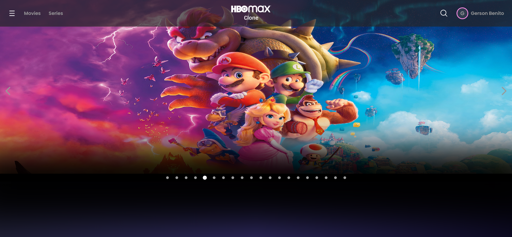
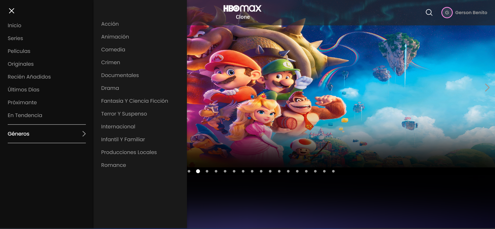

# HBOMax - Clone

This project was generated with [Angular CLI](https://github.com/angular/angular-cli) version 15.2.0.

## Development server

Run `ng serve` for a dev server. Navigate to `http://localhost:4200/`. The application will automatically reload if you change any of the source files.

Run `npm i` for a install depencies

# API TMDB
Get your Token and API key here 👉[TMDB](https://developer.themoviedb.org/) 
